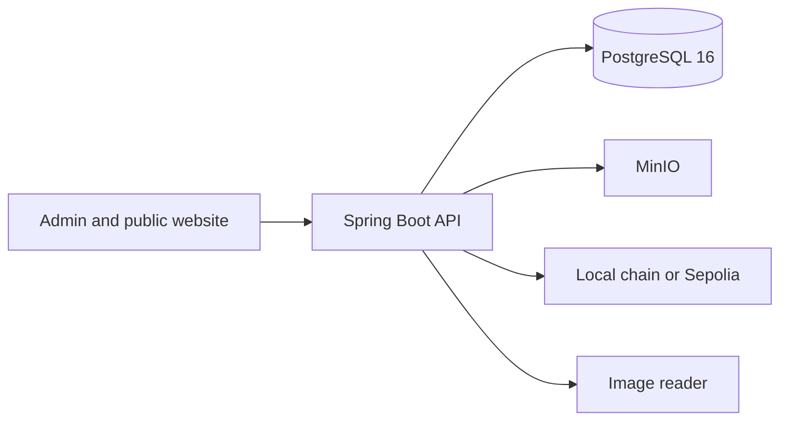

# CertiChain

CertiChain is a prototype where Demo University issues a digital certificate and anyone can check it from a public link. The certificate file stays off-chain. An SHA-256 fingerprint is what later gets anchored. Records in this project are synthetic. They are not real academic credentials.

## Architecture



The admin console and the public verification page use the API. Issuing a certificate writes an SHA-256 fingerprint, stores a PDF in MinIO, and registers that fingerprint in the `CertificateRegistry` contract. By default the contract runs on a local Anvil chain. Set `CHAIN_RPC_URL`, `CHAIN_PRIVATE_KEY`, and `CHAIN_ID=11155111` to anchor on Sepolia instead. Do not commit a funded key. The public Anvil development key in the dev profile must never be funded on a public network.

## Run the API

Java 21, Maven, and Docker are required.

```bash
docker compose up -d
cd backend
mvn spring-boot:run
```

- Health: http://localhost:8080/actuator/health
- API docs: http://localhost:8080/swagger-ui.html

The dev profile connects to `localhost:5433` with the database, user, and password `certichain`. Port 5433 is used so this does not collide with a PostgreSQL service already installed on Windows. Override those values with the variables in `.env.example`. Do not commit a `.env` file.

## Run the website

```bash
cd frontend
npm install
npm run dev
```

Open http://localhost:5173 and sign in with `admin@demouniversity.edu` / `certichain`. A public check such as http://localhost:5173/verify/CERT-2026-001245 can download the issued PDF, confirm that file, or scan a PDF, text record, or image.

## Tests

```bash
cd backend
mvn test
```
