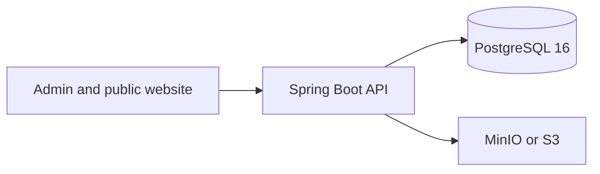

# CertiChain

CertiChain is a prototype where Demo University issues a digital certificate and anyone can check it from a public link. The certificate file stays off-chain. An SHA-256 fingerprint is what later gets anchored. Records in this project are synthetic. They are not real academic credentials.

## Architecture



The website already runs in the browser with local demo data. This phase adds the API skeleton and local Postgres and MinIO. Authentication, certificate issuing, blockchain, and document scanning are not in this phase.

## Run the API

Java 21, Maven, and Docker are required.

```bash
docker compose up -d
cd backend
mvn spring-boot:run
```

- Health: http://localhost:8080/actuator/health
- API docs: http://localhost:8080/swagger-ui.html

The dev profile connects to `localhost:5432` with the database, user, and password `certichain`. Override those with the variables in `.env.example`. Do not commit a `.env` file.

## Run the website

```bash
cd frontend
npm install
npm run dev
```

Open http://localhost:5173 and sign in with `admin@demouniversity.edu` / `certichain`. The site still keeps its own browser data until a later phase connects it to this API.

## Tests

```bash
cd backend
mvn test
```
